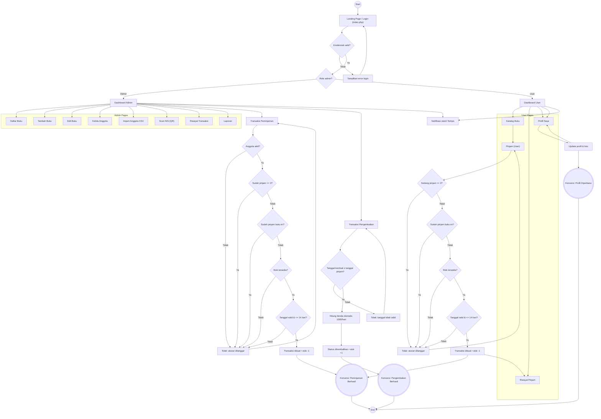

# Library Management System (Perpustakaan Digital)

[](https://www.php.net/)
[](https://www.mysql.com/)
[](https://getbootstrap.com/)

Sistem manajemen perpustakaan berbasis web untuk mengelola koleksi buku, anggota, serta transaksi peminjaman dan pengembalian. Aplikasi ini menyediakan panel admin untuk operasional perpustakaan dan panel user untuk katalog, peminjaman, dan riwayat.

## Daftar Isi

- [Fitur](#fitur)
- [Teknologi](#teknologi)
- [Arsitektur Singkat](#arsitektur-singkat)
- [Prasyarat](#prasyarat)
- [Instalasi](#instalasi)
- [Konfigurasi](#konfigurasi)
- [Penggunaan](#penggunaan)
  - [Akun Default](#akun-default)
  - [Alur Admin](#alur-admin)
  - [Alur User](#alur-user)
  - [Fitur QR / NIS](#fitur-qr--nis)
  - [Import Anggota (CSV)](#import-anggota-csv)
- [Screenshot](#screenshot)
- [Testing](#testing)
- [Kontribusi](#kontribusi)
- [Lisensi](#lisensi)
- [Kontak](#kontak)

## Fitur

**Admin**

- Dashboard statistik (buku, anggota, transaksi, jatuh tempo)
- Manajemen buku: tambah, edit, hapus, cover, stok, lokasi rak
- Manajemen anggota: tambah, edit, hapus, status aktif/nonaktif, foto profil
- Transaksi: peminjaman dan pengembalian (termasuk perhitungan denda)
- Riwayat transaksi
- Laporan (mis. buku populer)
- Scan NIS (QR) untuk percepat pemilihan anggota
- Import anggota dari CSV

**User**

- Katalog buku (pencarian dan browsing)
- Peminjaman buku (dengan validasi aturan)
- Riwayat peminjaman
- Profil user (update data + foto)
- Notifikasi jatuh tempo (mendekati tanggal kembali)

## Teknologi

- Backend: PHP (PDO)
- Database: MySQL / MariaDB
- UI: Bootstrap 5, Bootstrap Icons
- Komponen UI tambahan: jQuery, DataTables, SweetAlert
- QR: `phpqrcode` + `html5-qrcode` (browser camera)

## Arsitektur Singkat

- `config/database.php`: koneksi DB + helper (auth, sanitasi input, util upload)
- `admin/*`: halaman panel admin
- `user/*`: halaman panel user
- `proses/*`: handler POST/GET (login, CRUD, transaksi, endpoint JSON)
- `includes/*`: layout bersama (header/navbar/footer/alerts)
- `assets/*`: CSS/JS dan library QR

## Prasyarat

- PHP 8.0+ (disarankan 8.2+)
- MySQL 5.7+ atau MariaDB 10.4+
- Web server (Apache/Nginx) atau PHP built-in server
- Opsional (direkomendasikan untuk lokal): XAMPP/Laragon/WAMP

## Instalasi

1) Clone repository

```bash
git clone <URL_REPOSITORY_ANDA>
cd project-1_icc_20-21/LibraryManagement
```

2) Letakkan project di document root web server

- XAMPP (Windows): `C:\xampp\htdocs\LibraryManagement`
- Laragon: `C:\laragon\www\LibraryManagement`

3) Buat database dan import schema/data

Pilih salah satu:

- **Schema minimal**: import `database.sql`
- **Schema + sample data**: import `perpustakaan.sql` (disarankan untuk demo)

Contoh via phpMyAdmin:

1. Buat database `perpustakaan`
2. Import file `perpustakaan.sql`

## Konfigurasi

Konfigurasi disarankan menggunakan environment variables (agar kredensial tidak hardcoded):

- `APP_ENV` (default: `production`)
- `APP_DEBUG` (default: `0`)
- `BASE_URL` (default: `/LibraryManagement`)
- `DB_HOST` (default: `localhost`)
- `DB_USERNAME` (default: `root`)
- `DB_PASSWORD` (default: kosong)
- `DB_NAME` (default: `perpustakaan`)
- `APP_LOG_PATH` (default: `storage/logs/app.log`)
- `ENABLE_HTTPS_REDIRECT` (default: `0`) — aktifkan `1` di production jika sudah HTTPS
- `CSRF_TOKEN_TTL` (default: `7200`) — masa berlaku token CSRF (detik)

Catatan keamanan deployment:

- Wajib gunakan user database non-root dan password kuat.
- Pastikan aplikasi berjalan di HTTPS (aktifkan redirect setelah TLS siap).

Pastikan folder upload dapat ditulis oleh server:

- `proses/uploads/`
  - `proses/uploads/covers/`
  - `proses/uploads/profiles/`

Pastikan folder log dapat dibuat/ditulis:

- `storage/logs/`

## Penggunaan

Buka aplikasi:

- `http://localhost/LibraryManagement/`

### Akun Default

Tergantung file SQL yang Anda import:

- Jika menggunakan `database.sql`: akun admin default biasanya `admin` dengan password `password`.
- Jika menggunakan `perpustakaan.sql`: akun admin dan user sudah tersedia di tabel `users` (lihat isi dump untuk detail).

### Alur Admin

1. Login sebagai admin
2. Kelola buku: `Admin → Kelola Buku → Tambah Buku / Daftar Buku`
3. Kelola anggota: `Admin → Kelola Anggota`
4. Proses peminjaman: `Admin → Transaksi → Peminjaman`
5. Proses pengembalian: `Admin → Transaksi → Pengembalian`
6. Laporan: `Admin → Laporan`

### Alur User

1. Login sebagai user
2. Lihat katalog: `User → Katalog Buku`
3. Pinjam buku dari detail/halaman pinjam
4. Cek riwayat: `User → Riwayat Pinjam`
5. Update profil: `User → Profil`

### Fitur QR / NIS

- Halaman scan (admin): `Admin → Scan NIS (QR)`
- QR yang di-scan berisi nilai **NIS** (diimplementasikan sebagai `username` user) untuk lookup anggota.

Endpoint terkait:

- `proses/get_anggota_by_nis.php?nis=<NIS>` → JSON data anggota
- `proses/generate_qr.php?id=<user_id>` → generate QR PNG (khusus admin)

### Import Anggota (CSV)

Buka: `Admin → Kelola Anggota → Import Anggota`

Format CSV (minimal header `nis`):

```csv
nis,nama,email,no_hp,alamat,status
12345,Budi,budi@example.com,08123456789,"Jakarta",aktif
```

Catatan:

- `nis` akan dipakai sebagai `username`.
- Password default mengikuti nilai `nis`.
- Jika `email` kosong, sistem akan mengisi otomatis menjadi `<nis>@import.local`.

## Screenshot

Tambahkan screenshot di folder misalnya `docs/screenshots/` lalu tautkan di sini:

- Dashboard Admin
- Katalog User
- Form Peminjaman/Pengembalian

Contoh (ganti path sesuai file Anda):

```md

```

## Testing

Jalankan unit test:

```bash
php tests.php
```

Jalankan integration test (HTTP + cek header keamanan):

```bash
php tests/http_integration.php
```

Project ini belum menggunakan framework testing resmi (mis. PHPUnit). Saat ini tersedia smoke test sederhana:

```bash
php tests.php
```

Untuk pengembangan lebih lanjut, direkomendasikan menambahkan PHPUnit via Composer dan membuat test untuk:

- Validasi aturan peminjaman (maks 3 buku, maks 14 hari)
- Perhitungan denda saat pengembalian
- Upload file (cover/profil) dan pembersihan file lama

## Kontribusi

Kontribusi sangat diterima.

1. Fork repository
2. Buat branch fitur: `git checkout -b feat/nama-fitur`
3. Pastikan perubahan tidak memecahkan alur utama (login, buku, anggota, transaksi)
4. Buat PR dengan deskripsi jelas dan langkah uji/reproduksi

Pedoman teknis:

- Gunakan prepared statement untuk query DB.
- Jangan menampilkan detail error database ke user (hindari leak info sensitif).
- Ikuti pola `requireLogin()` / `requireAdmin()` pada halaman yang butuh proteksi.



## Kontak

- Maintainer: (isi nama/tim)
- Email: (isi email)
- Issue tracker: gunakan tab **Issues** di GitHub untuk bug report dan feature request

